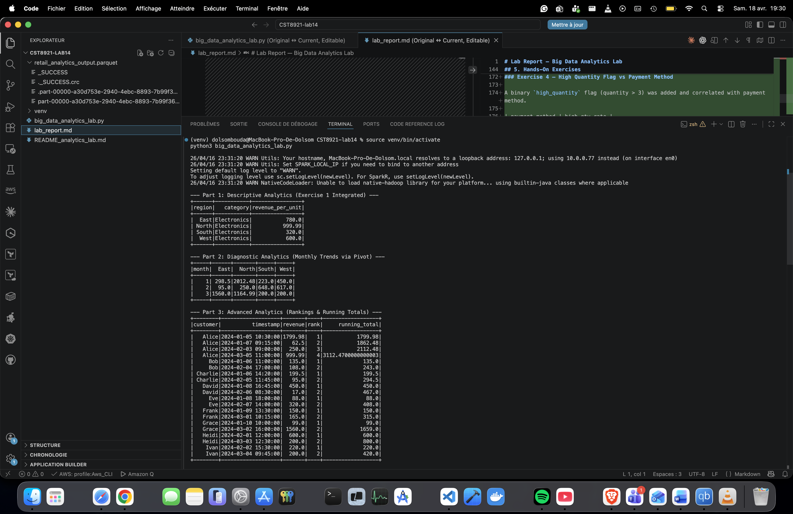
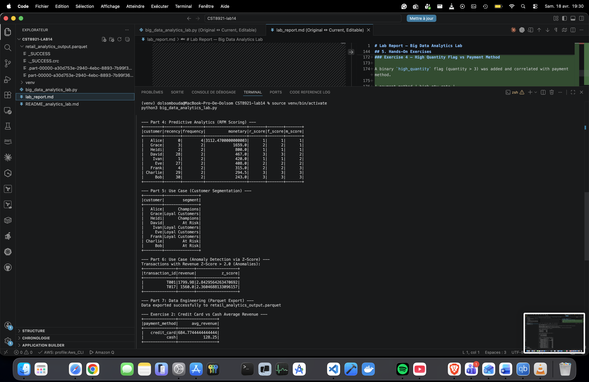
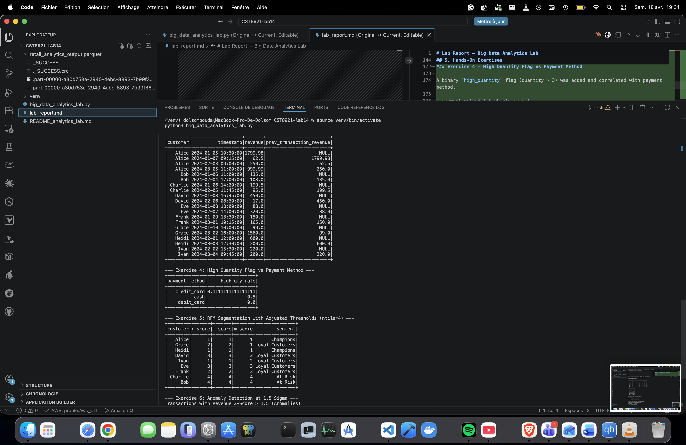
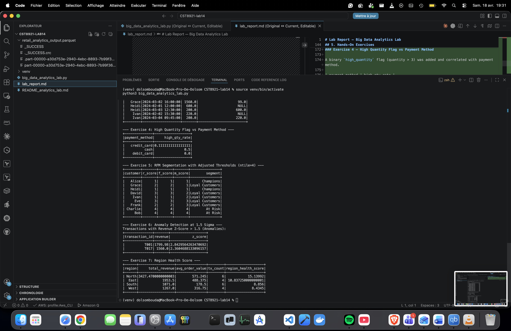

# Lab Report — Big Data Analytics Lab
## CST8921 — Lab 14

---

## 1. Overview

This lab explores the full spectrum of big data analytics using **PySpark** on a simulated retail transactions dataset. It covers four types of analytics (descriptive, diagnostic, advanced/window-based, and predictive), two real-world use cases, and a data engineering output step. Seven hands-on exercises were also completed.

---

## 2. Environment

| Component | Version |
|-----------|---------|
| OS | macOS (Apple Silicon) |
| Python | 3.11 (via virtual environment) |
| PySpark | 3.5.3 |
| Java | OpenJDK 17.0.18 (Homebrew) |

A Python 3.11 virtual environment was required because PySpark 3.5.x is not compatible with Python 3.14 (the default Homebrew version) due to pickling protocol changes.

---

## 3. Dataset

The dataset simulates 20 retail transactions across 4 regions (North, South, East, West), 3 product categories (Electronics, Clothing, Food), and 9 customers, spanning January to March 2024.

**Schema:**

| Field | Type |
|-------|------|
| id | Integer |
| transaction_id | String |
| customer | String |
| region | String |
| category | String |
| unit_price | Double |
| quantity | Integer |
| timestamp | String → Timestamp |
| payment_method | String |

A `revenue` column (`unit_price × quantity`) was derived at load time.

---

## 4. Lab Parts

### Part 1 — Descriptive Analytics

A `revenue_per_unit` column was added and a window function (`row_number()` partitioned by region, ordered by `revenue_per_unit` descending) was used to find the most expensive category per region.

**Result:** Electronics is the top-revenue-per-unit category in all four regions.



| region | category | revenue_per_unit |
|--------|----------|-----------------|
| East | Electronics | 780.0 |
| North | Electronics | 999.99 |
| South | Electronics | 320.0 |
| West | Electronics | 600.0 |

---

### Part 2 — Diagnostic Analytics (Monthly Trends via Pivot)

Revenue was aggregated by month and pivoted by region to observe monthly trends.



| month | East | North | South | West |
|-------|------|-------|-------|------|
| 1 | 298.5 | 2012.48 | 223.0 | 450.0 |
| 2 | 95.0 | 250.0 | 648.0 | 617.0 |
| 3 | 1560.0 | 1164.99 | 200.0 | 200.0 |

North dominates in January, while East surges in March driven by a large Electronics purchase.

---

### Part 3 — Advanced Analytics (Rankings & Running Totals)

Using `rank()` and `sum()` as window functions partitioned by customer and ordered by timestamp, each transaction was ranked within its customer's history and a running revenue total was computed.



Alice has the highest cumulative revenue at **$3,112.47** across 4 transactions.

---

### Part 4 — Predictive Analytics (RFM Scoring)

RFM (Recency, Frequency, Monetary) features were engineered per customer, then scored into 3 tiers using `ntile(3)` window functions (score 1 = best, 3 = worst).



| customer | recency | frequency | monetary | r_score | f_score | m_score |
|----------|---------|-----------|----------|---------|---------|---------|
| Alice | 0 | 4 | 3112.47 | 1 | 1 | 1 |
| Grace | 3 | 2 | 1659.0 | 2 | 2 | 1 |
| Heidi | 2 | 2 | 800.0 | 1 | 1 | 1 |
| David | 28 | 2 | 467.0 | 3 | 3 | 2 |
| Ivan | 1 | 2 | 420.0 | 1 | 1 | 2 |
| Eve | 27 | 2 | 408.0 | 2 | 2 | 2 |
| Frank | 4 | 2 | 315.0 | 2 | 2 | 3 |
| Charlie | 29 | 2 | 294.5 | 3 | 3 | 3 |
| Bob | 30 | 2 | 243.0 | 3 | 3 | 3 |

---

### Part 5 — Customer Segmentation

RFM scores were mapped to segments using the following rules:
- `r_score == 1 AND m_score == 1` → **Champions**
- `r_score == 3` → **At Risk**
- otherwise → **Loyal Customers**

| customer | segment |
|----------|---------|
| Alice | Champions |
| Grace | Loyal Customers |
| Heidi | Champions |
| David | At Risk |
| Ivan | Loyal Customers |
| Eve | Loyal Customers |
| Frank | Loyal Customers |
| Charlie | At Risk |
| Bob | At Risk |

---

### Part 6 — Anomaly Detection (Z-Score)

Revenue mean and standard deviation were computed globally. Transactions with `|z_score| > 2.0` were flagged as anomalies.

| transaction_id | revenue | z_score |
|----------------|---------|---------|
| T001 | 1799.98 | 2.843 |
| T017 | 1560.0 | 2.360 |

Both anomalies are large Electronics purchases (Alice's 2-unit order and Grace's 2-unit order).

---

### Part 7 — Data Engineering (Parquet Export)

The enriched DataFrame was exported to `retail_analytics_output.parquet` using columnar Parquet format with overwrite mode, ready for downstream consumption.

---

## 5. Hands-On Exercises

### Exercise 1 — revenue_per_unit (integrated into Part 1)
Added `revenue_per_unit = revenue / quantity` and identified the most expensive category per region using a window function. Result: Electronics leads in all regions.

---

### Exercise 2 — Credit Card vs Cash Average Revenue

Filtered to `credit_card` and `cash` transactions and compared average revenue.

| payment_method | avg_revenue |
|----------------|-------------|
| credit_card | 684.77 |
| cash | 128.25 |

Credit card transactions generate on average **5.3× more revenue** than cash, indicating credit card users purchase higher-value items (primarily Electronics).

---

### Exercise 3 — Previous Transaction Revenue (F.lag)

Added a `prev_transaction_revenue` column using `F.lag()` over a window partitioned by customer and ordered by timestamp. The first transaction per customer correctly returns `NULL`.

This enables delta analysis — e.g., identifying whether a customer's spending is increasing or decreasing over time.

---

### Exercise 4 — High Quantity Flag vs Payment Method

A binary `high_quantity` flag (quantity > 3) was added and correlated with payment method.

| payment_method | high_qty_rate |
|----------------|---------------|
| credit_card | 0.111 |
| cash | 0.500 |
| debit_card | 0.000 |

Cash transactions have the highest rate of high-quantity purchases (50%), while debit card users never buy in high quantities in this dataset.

---

### Exercise 5 — RFM with Adjusted Thresholds (ntile=4)

Switching from `ntile(3)` to `ntile(4)` creates finer-grained scoring. With 9 customers, this pushes Charlie and Bob to score 4 (At Risk), while David and Eve remain in the middle tiers as Loyal Customers. This demonstrates how threshold choice directly impacts segment distribution.

---

### Exercise 6 — Anomaly Detection at 1.5 Sigma

Lowering the threshold from 2.0σ to 1.5σ did not flag any additional transactions — T001 and T017 remain the only anomalies. This indicates the revenue distribution has a moderate spread with no borderline outliers between 1.5σ and 2.0σ.

---

### Exercise 7 — Region Health Score

A composite `region_health_score` was computed as:

```
(total_revenue / 1000) + (avg_order_value / 100) + tx_count
```

| region | total_revenue | avg_order_value | tx_count | region_health_score |
|--------|--------------|-----------------|----------|---------------------|
| North | 3427.47 | 571.25 | 6 | 15.14 |
| East | 1953.5 | 488.38 | 4 | 10.84 |
| South | 1071.0 | 178.5 | 6 | 8.86 |
| West | 1267.0 | 316.75 | 4 | 8.43 |

North is the healthiest region, driven by the highest total revenue and average order value. South has the same transaction count as North but scores much lower due to low average order value.

---

## 6. Key Takeaways

- **Electronics** is the highest-value category across all regions and is the primary driver of revenue anomalies.
- **Alice** is the top customer by every RFM dimension — most recent, most frequent, and highest monetary value.
- **Credit card** users spend significantly more per transaction than cash or debit card users.
- **North** is the strongest performing region by composite health score.
- RFM segmentation is sensitive to the number of tiers (`ntile` value) — choosing the right granularity matters for actionable segmentation.
- The revenue distribution has two clear outliers (T001, T017) that stand out even at a strict 2σ threshold.
